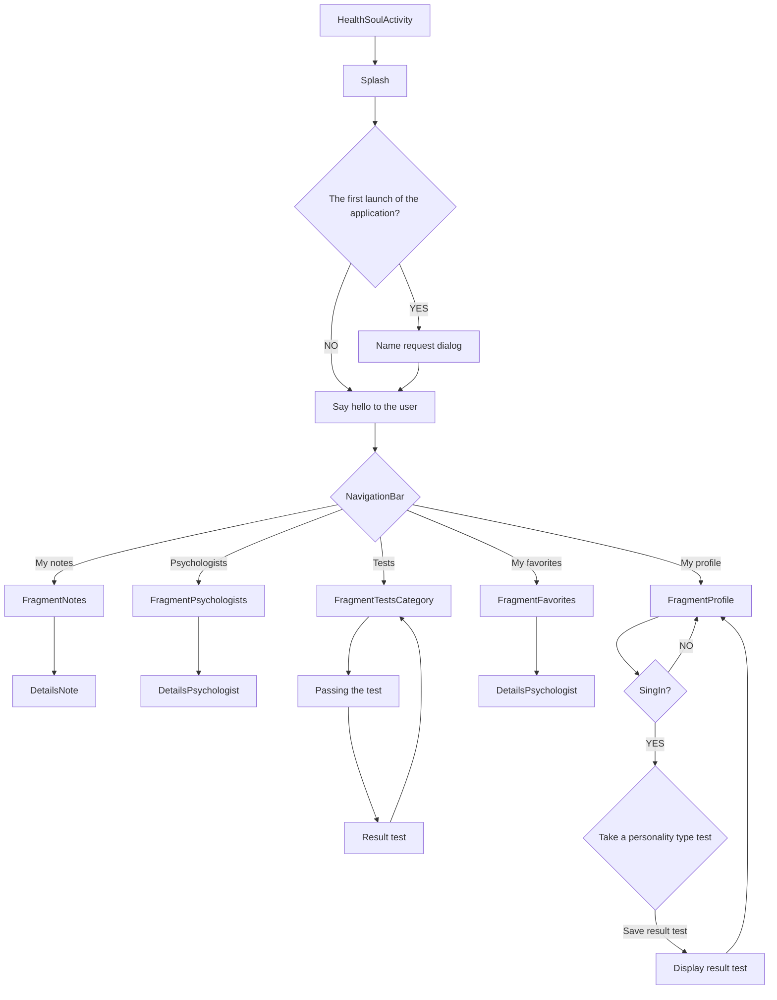

# HealthySoul

```mermaid
flowchart TD
A[HealthSoulActivity] --> B[Splash]
B --> C{The first launch of the application?}
C -- YES --> D[Name request dialog]
C -- NO --> E[Say hello to the user]
D --> E[Say hello to the user]
E --> F{NavigationBar}
F -- My notes --> G[FragmentNotes]
F -- Psychologists --> H[FragmentPsychologists]
F -- Tests --> I[FragmentTestsCategory]
F -- My profile --> J[FragmentProfile]
F -- My favorites --> K[FragmentFavorites]
G --> L[DetailsNote];
H --> M[DetailsPsychologist];
I --> N[Passing the test]
N --> O[Result test]
O --> I[FragmentTestsCategory]
J --> P{SingIn?}
P -- YES --> Q{Take a personality type test}
P -- NO --> J[FragmentProfile]
Q -- Save result test --> R[Display result test]
R --> J[FragmentProfile]
K --> S[DetailsPsychologist];
```
