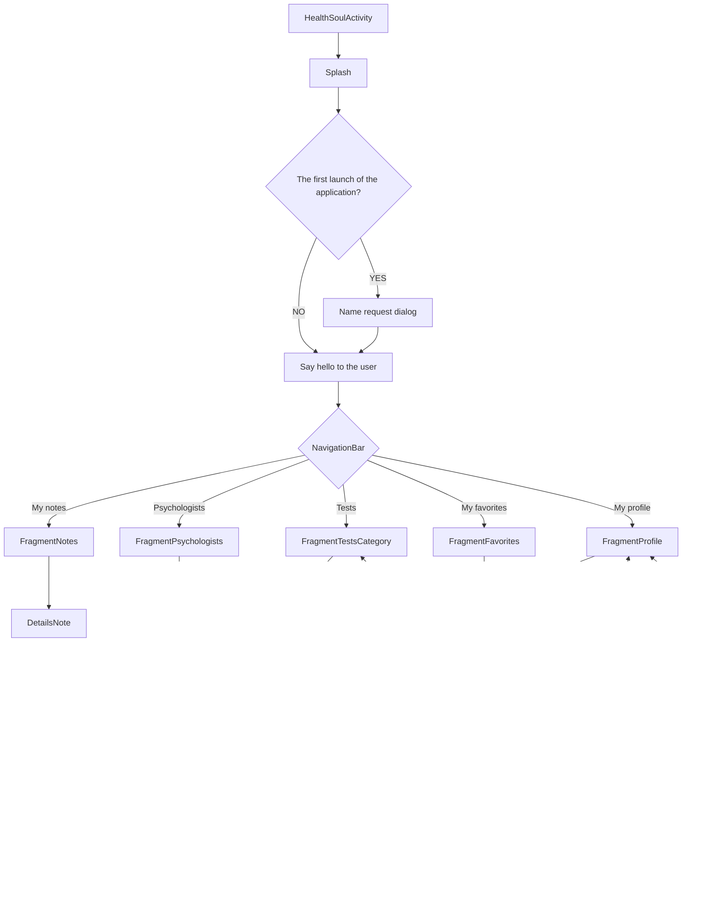
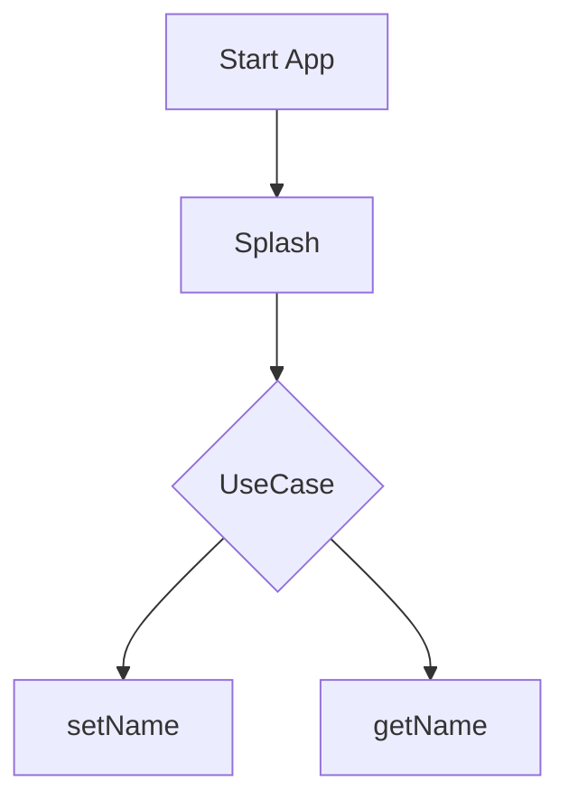
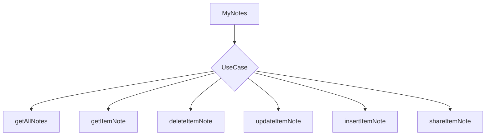
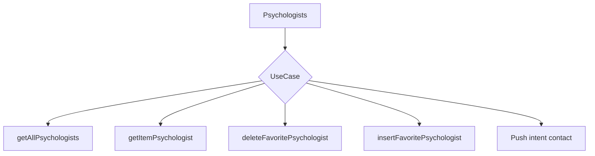
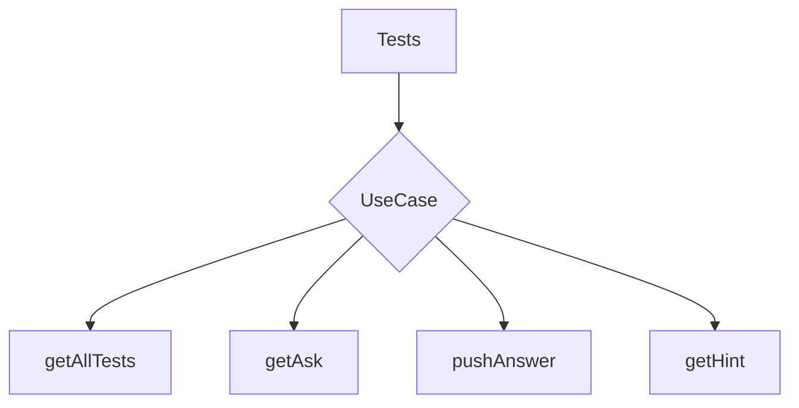
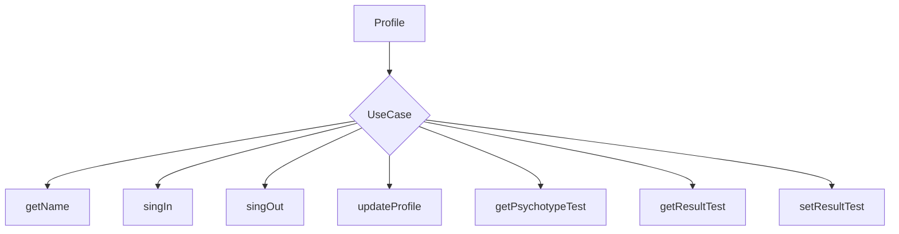
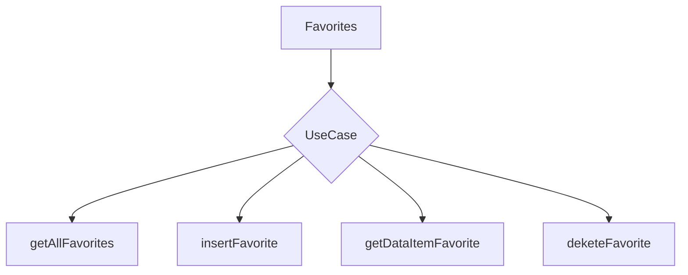

# HealthySoul

```mermaid
flowchart TD
A[HealthSoulActivity] --> B[Splash]
B --> C{The first launch of the application?}
C -- YES --> D[Name request dialog]
C -- NO --> E[Say hello to the user]
D --> E[Say hello to the user]
E --> F{NavigationBar}
F -- My notes --> G[FragmentNotes]
F -- Psychologists --> H[FragmentPsychologists]
F -- Tests --> I[FragmentTestsCategory]
F -- My profile --> J[FragmentProfile]
F -- My favorites --> K[FragmentFavorites]
G --> L[DetailsNote];
H --> M[DetailsPsychologist];
I --> N[Passing the test]
N --> O[Result test]
O --> I[FragmentTestsCategory]
J --> P{SingIn?}
P -- YES --> Q{Take a personality type test}
P -- NO --> J[FragmentProfile]
Q -- Save result test --> R[Display result test]
R --> J[FragmentProfile]
K --> S[DetailsPsychologist];
```

```mermaid
flowchart TD
A[Start App] --> B[Splash] --> C{UseCase}
C --> D[setName];
C --> E[getName];
```

```mermaid
flowchart TD
F[MyNotes] --> G{UseCase}
G --> GA[getAllNotes];
G --> GB[getItemNote];
G --> GC[deleteItemNote];
G --> GD[updateItemNote];
G --> GE[insertItemNote];
G --> GF[shareItemNote];
```

```mermaid
flowchart TD
H[Psychologists] --> I{UseCase}
I --> IA[getAllPsychologists];
I --> IB[getItemPsychologist];
I --> IC[deleteFavoritePsychologist];
I --> ID[insertFavoritePsychologist];
I --> IE[Push intent contact]
```

```mermaid
flowchart TD
J[Tests] --> K{UseCase}
K --> KA[getAllTests];
K --> KB[getAsk];
K --> KC[pushAnswer];
K --> KD[getHint];
```

```mermaid
flowchart TD
N[Profile] --> O{UseCase}
O --> OA[getName];
O --> OB[singIn];
O --> OC[singOut];
O --> OD[updateProfile];
O --> OE[getPsychotypeTest];
O --> OF[getResultTest];
O --> OG[setResultTest];
```

```mermaid
flowchart TD
L[Favorites] --> M{UseCase}
M --> KA[getAllFavorites];
M --> KB[insertFavorite];
M --> KC[getDataItemFavorite];
M --> KD[deketeFavorite];
```
